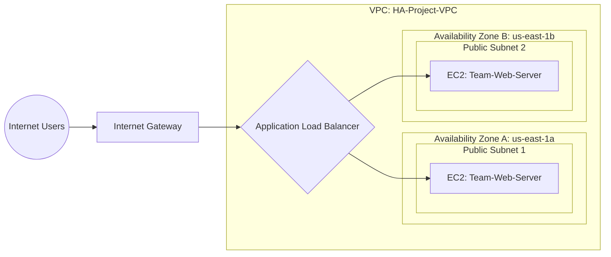

# AWS High Availability Web Architecture ☁️

A fault-tolerant, highly available web architecture deployed on Amazon Web Services (AWS) using Infrastructure as Code (IaC) via AWS CloudFormation. This project was developed as part of the DEPI AWS Cloud Security training program.

## 👥 Team Members
* **Rana Abdelsalam**
* **Heba Youssef**
* **Menna Gamal**

## 🏗️ Architecture Diagram
The following diagram is generated using Mermaid.js to illustrate our VPC structure and traffic flow:


## 🛠️ Infrastructure Components
- Virtual Private Cloud (VPC): Custom network spanning two Availability Zones.

- Public & Private Subnets: Structured for security and scalability.

- Internet Gateway (IGW): Enables outbound and inbound internet access for public subnets.

- Application Load Balancer (ALB): Distributes incoming HTTP traffic across the EC2 instances.

- Auto Scaling Group (ASG): Dynamically scales the EC2 fleet (Min: 2, Max: 4) using a custom Launch Template.

- Security Groups: Enforces the principle of least privilege (EC2 instances only accept traffic from the ALB).

## 🚀 Deployment Instructions
1. Clone this repository:
```bash
git clone https://github.com/RanaAbdelsalamm/AWS-HA-Architecture.git
```

2. Log in to the AWS Management Console and navigate to CloudFormation.

3. Select Create stack > With new resources (standard).

4. Upload the template.yaml file included in this repository.

5. Provide a Stack Name and click Next through the options, then click Submit.

6. Wait for the status to show CREATE_COMPLETE.

7. Navigate to the EC2 Console -> Load Balancers, copy the ALB DNS name, and paste it into your browser to view the live web server.

## 🛡️ Security Posture
- ALB Security Group: Allows HTTP 80 from 0.0.0.0/0.

- Web Server Security Group: Strictly allows HTTP 80 only from the ALB Security Group, preventing direct external access to the EC2 instances.

  ## And Thank You ;]
