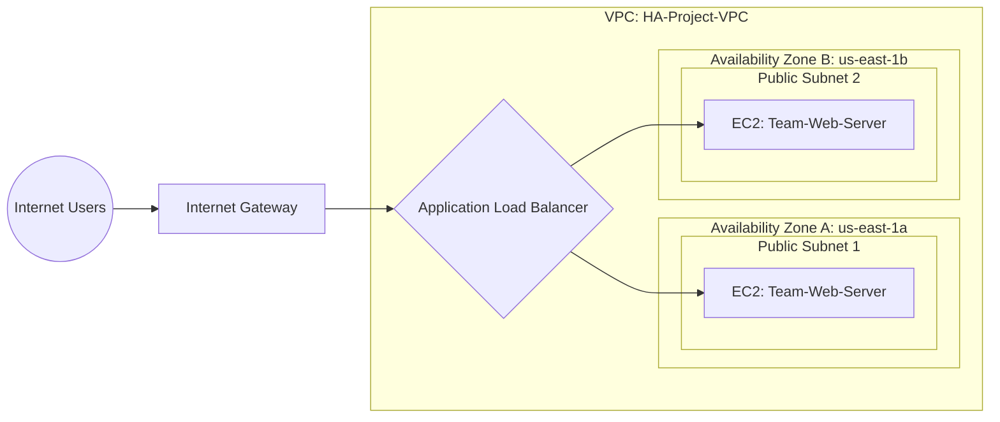

# AWS High Availability Web Architecture ☁️

A fault-tolerant, highly available web architecture deployed on Amazon Web Services (AWS) using Infrastructure as Code (IaC) via AWS CloudFormation. This project was developed as part of the DEPI AWS Cloud Security training program.

## 👥 Team Members
* **Rana Abdelsalam**
* **Heba Youssef**
* **Menna Gamal**

## 🏗️ Architecture Diagram
The following diagram is generated using Mermaid.js to illustrate our VPC structure and traffic flow:

🛠️ Infrastructure Components
Virtual Private Cloud (VPC): Custom network spanning two Availability Zones.

Public & Private Subnets: Structured for security and scalability.

Internet Gateway (IGW): Enables outbound and inbound internet access for public subnets.

Application Load Balancer (ALB): Distributes incoming HTTP traffic across the EC2 instances.

Auto Scaling Group (ASG): Dynamically scales the EC2 fleet (Min: 2, Max: 4) using a custom Launch Template.

Security Groups: Enforces the principle of least privilege (EC2 instances only accept traffic from the ALB).
